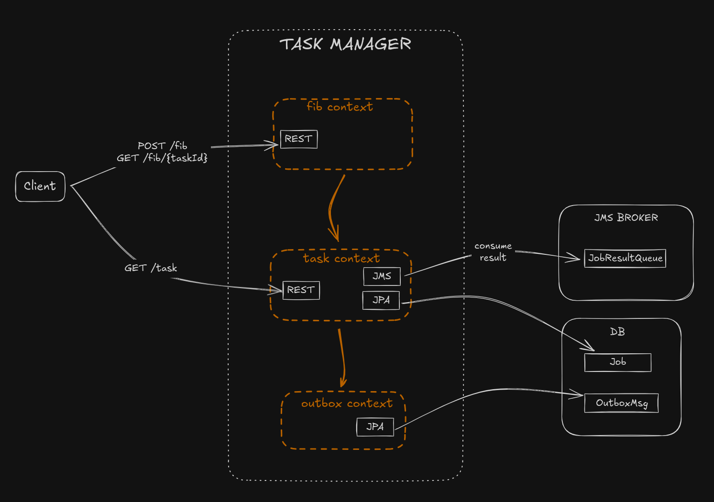

# FIBONACCI Task Manager

This application was design in hexagonal architecture with few bounded contexts (modules):



For more description see: [fibonacci-cluster-docker](https://github.com/gerardolenski/fibonacci-cluster-docker) and [fibonacci-cluster-k8s](https://github.com/gerardolenski/fibonacci-cluster-k8s)

## Requirements
- Java 21
- Artemis
- PostgreSQL

## Configuration

App can be configured by environment variables:

- `BROKER_URL` - the URI to connect to the Artemis cluster
- `BROKER_USER` - the Artemis user
- `BROKER_PASSWORD` - the Artemis password
- `JOB_RESULT_QUEUE_NAME` - the name of the job result queue
- `RESULT_LISTENER_CONCURRENCY` - the consumer concurrency, by default `1-10`
- `JMS_SESSION_CACHE_SIZE` - the size of the cache for `SessionConnectionFactory`, by default `5`


- `TOMCAT_PORT` - the port of exposed API, by default `8080`


- `POSTGRES_DATASOURCE_URL` - the URL to the PostgreSQL datasource 
- `POSTGRES_USER` - the database user
- `POSTGRES_PASSWORD` - the database password
- `POSTGRESS_POOL_SIZE` - the database connection pool size, by default `5`
- `POSTGRESS_CONNECTION_TIMEOUT` the database connection timeout, by default `5000` ms


- `FIB_ALGORITHMS` - the list of active Fibonacci numbers algorithms, by default all are activated. The possible values are: `ITERATIVE`,`RECURSIVE`,`BINETS`,`EXPONENTIAL`


The example configuration:
```
BROKER_URL=tcp://localhost:61616
BROKER_USER=artemis
BROKER_PASSWORD=artemis
JOB_RESULT_QUEUE_NAME=job-result

POSTGRES_DATASOURCE_URL=jdbc:postgresql://localhost:5432/task_manager
POSTGRES_PASSWORD=postgres
POSTGRES_USER=postgres
```